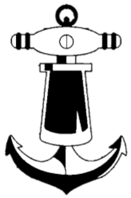
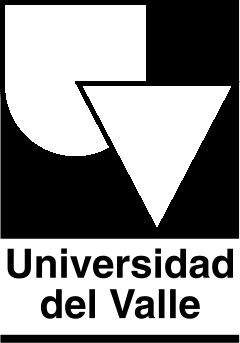
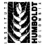
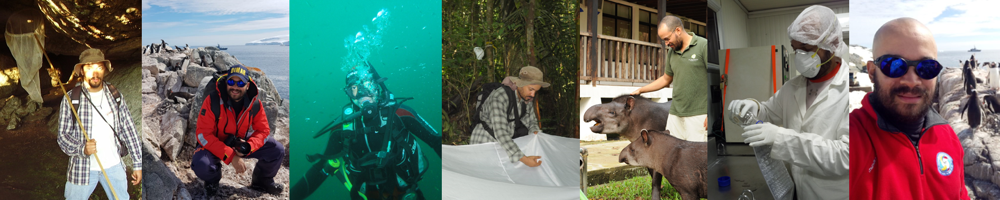

Hola :hello:, mi nombre es Christian Bermúdez-Rivas, soy **biólogo** y trabajo como investigador científico en el área de Protección del Medio Marino del  [Centro de Investigaciones Oceanográficas e Hidrográficas del Pacífico](https://www.cccp.org.co/) de la   [Dirección General Marítima](https://www.dimar.mil.co/). Estudié mi carrera [profesional](https://ciencias.univalle.edu.co/pregrados/biologia) y mi [maestría](https://ciencias.univalle.edu.co/posgrados/maestria-en-ciencias-biologia) en la   [Universidad del Valle](https://www.univalle.edu.co/). Desarrollé el interés por el **análisis espacial** durante mi carrera y estudié una especialización tecnológica en **Sistemas de Información Geográfica** en el   [Servicio Nacional de Aprendizaje - SENA](https://www.sena.edu.co/es-co/Paginas/default.aspx).

Desde los primeros semestres de la carrera me interesé mucho por la **biología de los invertebrados** (*e.g.* artropodos de suelo, artropodos de dosel, invertebrados acuáticos), **la ecología** y la **biología de la conservación** desde un enfoque en el **análisis espacial**, por lo tanto comencé a estudiar las emergentes tecnologías geográficas como los **sistemas de información geográfica** y la **geomática**; por esta razón desarrollé mi trabajo de pregrado en la distribución de las libélulas de Valle del Cauca y posteriormente desarrollé mi tesis de maestría en los patrones de distribución de la biodiversidad de artópodos de suelo.

En las primeras etapas de mi carrera me dediqué a la [docencia universitaria](teaching) y la consultoría en biología de campo en diferentes proyectos (*e.g.*  [Instituto Alexander von Humboldt](http://www.humboldt.org.co/es/), Colombia;   [Ecuambiente](https://www.ecuambiente.com/), Ecuador), sin embargo y gracias a mis habilidades en el campo de la geomática inicié como investigador en la  [Dirección General Marítima](https://www.dimar.mil.co/), donde he apoyado la investigación en un campo diferente al que me había dedicado, **el océano**.

